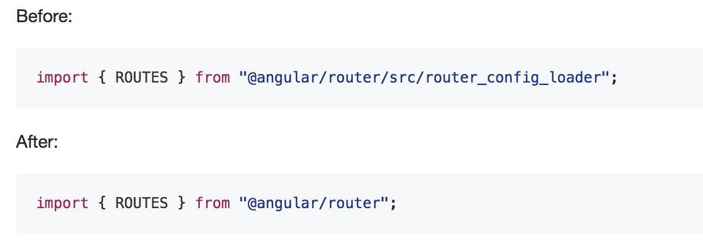

<!-- .element: id="what-s-new-in-angular-4" style="font-size: 0.9em;" -->
# What's new in Angular 4

@pastelInc

---

<!-- .slide: data-background="./img/angular4announcement.png" -->

Note:
- 自己紹介
- Angular 4の魅力をお届け

---

<!-- .slide: data-background="./img/breaking-changes.png" -->

Note:
- AngularJSからAngular 2のリリースまでの道のり
- 予告のない破壊的変更が多く開発者を悩ませました
- リリースノートを見て問題に気がつくことも少なくありませんでした
- 問題発見までの道のりもかなり大変だった
- Angular 2からAngular 4のリリースでは開発者に安定性をお届けします

---

## Semantic Versioning

http://semver.org/

Note:
- 安定したリリースのためにSemVerを採用
- Angular 2.0のリリース時 (09/2016) からすでに実践済み

----

<!-- .slide: data-background-size="1200px" data-background="./img/semver.png" -->

Note:
- すべてバージョン番号に意味を追加すること
- アップグレードの理由がわかる
- 安全にバージョンを上げることができる

---

## Time-based Release Cycles

Note:
- AngularJSからAngular 2は完全な書き換えだった
- Angular 2からAngular 4以降に関しては完全な書き換えではない
- APIの廃止までの段階があります
- AngularチームはBreaking Changesがあっても自動でアップグレードするツールを使っている

----

<!-- .slide: data-background-size="1100px" data-background="./img/release-diagram.png" -->

Note:
- パッチバージョンを週に1回
- マイナーバージョンをメジャーバージョンのリリース後3ヶ月間毎月
- **下位互換性のある**メジャーバージョンを6ヶ月毎にリリースします

---

## Deprecation Policy

Note:
- リリースノートで廃止予定を発表
- 更新 (削除まで) には6か月以上の猶予があります
- peer dependencies なライブラリ (バージョンを決め打ちで使っているもの) TypeScriptやRxJSやZone.jsなどの更新もSemVer対象
- Breaking Changesでないのであればマイナーチェンジでの更新もある

---

## New View Engine

----

### AOT Compiler

- Angularは実行時にテンプレートの生成とディレクティブ, 要素, クエリの更新するためのViewEngineをコンパイルして作成する
- AOT (Ahead-of-time compilation) コンパイル / JIT (Just-in-time compilation) コンパイル
- テンプレートエラーを早期に検出し、ビルド時にコンパイルすることでパフォーマンスを向上させることが主目的

Note:
- Closure Compiler
- Inferno.jsなどが同じくらいのパフォーマンス
- Tree Shakingに対応したモジュールバンドラでbundle (Webpack / Rollup / Tsickle and Clutz)

----

<!-- .slide: data-background-size="" data-background="./img/code-size.png" -->

Note:
- **Closure Compiler無し**でおよそ3分の一までテンプレートサイズを削減

----

<!-- .slide: data-background-size="1300px" data-background="./img/bentchmark.png" -->

Note:
- DOMノードの作成と破棄は同じくらい
- 更新は少し時間がかかりメモリも消費する

----

<!-- .slide: data-background-size="1300px" data-background="./img/change-detection.png" -->

Note:
- 131,040のバインディングのChange Detection
- 1.5倍の時間がかかり20倍のメモリを消費
- OnPushコンポーネントがあるから部分的に更新するように工夫しよう

---

## `*ngIf` 構文の拡張

```html
<ng-template #loading>Loading...</ng-template>
<div *ngIf="userObservable | async; else loading; let user">
  {{ user.name }}
</div>
```

https://blog.lacolaco.net/post/ng4-feature-ngif/

Note:
- ngIfによる条件付けと、その条件により制御されるテンプレートを分離
- これまでは真の場合と偽の場合にそれぞれ逆の条件のngIfが必要
- ngIfに渡された式の評価結果をローカル変数にアサインできる

---

## `@angular/animation` 爆誕

- コアモジュールから分離しました
- 必要な場合だけ利用するようにしましょう
- アニメーションが必要なライブラリをインストールすると自動でインストールされます(e.g. Material)

---

## TypeScript 2.1

- ngcが早くなりました
- compilerの最適化とより良いエラーの恩恵が受けられるようになりました
- TypeScript2.1は1.8と互換性がありません

---

## StrictNullChecks

```javascript
let foo = undefined;
foo = null; // NOT Okay
```

```javascript
interface Member {
  name: string,
  age?: number
}

getMember()
  .then(member: Member => {
    const stringifyAge = member.age.toString()
    // Object is possibly 'undefined'
  })
```

Note:
- TypeScriptのStrictNullChecksに準拠しました
- 必要に応じて、プロジェクトでStrictNullChecksを有効にすることができます
- undefinedを割り当てるのかNullを割り当てるのか厳密になる

---

## Angular Universal

https://github.com/FrozenPandaz/ng-universal-demo

Note:
- Universalの数カ月分の作業成果がコミットされている
- ドキュメントが出るから寝て待て

---

## Flat ES Modules (Flat ESM / FESM)
## ES2015 Builds



Note:
- 試験的リリース
- Tree ShakingをES2015モジュールで最大限活かす

----

<!-- .slide: data-background-size="" data-background="./img/will-support-webpack.png" -->

----

<!-- .slide: data-background-size="" data-background="./img/igor-comments-on-webpack.png" -->

Note:
- ファイルに7つのシンボルが含まれ、1つだけがインポートされると、7つのシンボルがすべて取り込まれます
- package.jsonの "es2015"プロパティを解決するようにWebpackを設定してください

---

## まとめ

- Angularは安定したバージョンアップができるように環境を整備した
- New View Engineをはじめとする努力でより高速に<br />アプリケーションを提供できるようになった

---

## 参考にした資料

- [Angular - Generating less code](https://docs.google.com/document/d/195L4WaDSoI_kkW094LlShH6gT3B7K1GZpSBnnLkQR-g/preview)
- [Ok... let me explain: it's going to be Angular 4.0, or just Angular](http://angularjs.blogspot.jp/2016/12/ok-let-me-explain-its-going-to-be.html)
- [Igor Minar - Opening Keynote - Version 4 Announcement - NG-BE 2016](https://www.youtube.com/watch?v=aJIMoLgqU_o)
- [Versioning and Releasing Angular](http://angularjs.blogspot.jp/2016/10/versioning-and-releasing-angular.html)
- [日本語訳：Angular 2 Change Detection Explained](http://qiita.com/laco0416/items/523d96ddbfe55c4e6949)
- [Angular AoTガイド](http://qiita.com/Quramy/items/a603ddb47d6e4b3497e1)
- [AHEAD-OF-TIME COMPILATION](https://angular.io/docs/ts/latest/cookbook/aot-compiler.html)
